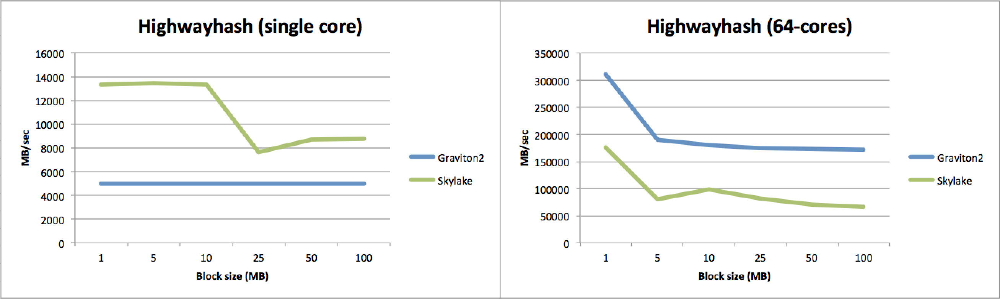
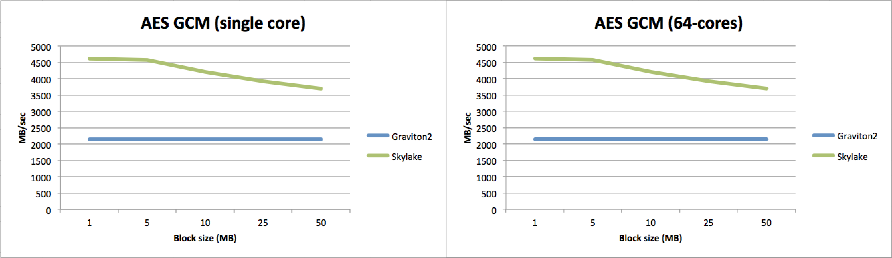
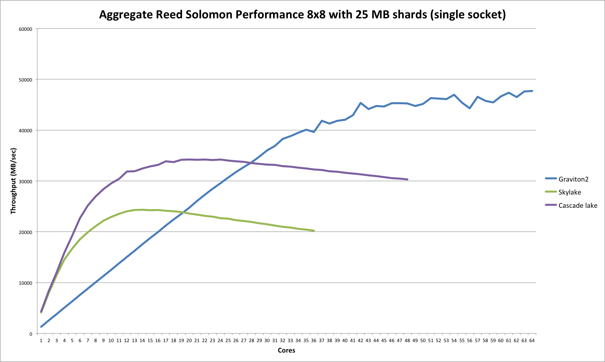

# Intel rules single-core performance but ARM dominates multi-core performance

The recent announcement from AWS about the general availability of their new ARM-powered Graviton2 servers caused us to take another look at the performance of these ARM servers. In this blog post we describe the results which you may find surprising.

## Introduction

[Minio](https://github.com/minio/minio) is an Apache licensed, open source S3-compatible object storage server with a particular focus on high performance. It is capable of reading and writing [10s of GBs/sec](https://blog.min.io/s3-benchmark-using-hdd/) using ordinary harddisks or even [100s of GBs/sec](https://blog.min.io/performance-at-scale-minio-pushes-past-1-3-terabits-per-second-with-256-nvme-drives/) using 100 Gbit networking in combination with SSDs or NVME drives.

In order to achieve these high levels of performance, Minio takes advantage of the tightly integrated assembly language feature of Golang (Minio's primary development language).

Two of Minio's core algorithms that are computationally demanding are erasure coding (for data durability) and hashing (for bit-rot detection). Both these algorithms are heavily optimized using SIMD (single instruction multiple data) instructions not just for the Intel platform (AVX2 and AVX512) but also for ARM (NEON) as well as PowerPC (VSX). 

A third key algorithm that Minio relies on is (per object) encryption. Due to the fact that the Golang's standard library offers great support for various encryption techniques with optimized code, minio simply uses these implementations.

Because of the highly optimized nature of its core algorithms, Minio is a great target to do comparative benchmarking between different CPU architectures. However, in order to eliminate any system effects such as networking speeds and/or storage media throughputs, we chose to do a separate benchmarking test as described below.

## Benchmarking methodology

In order to compare how the new Graviton2 CPUs stack up against Intel, we ran tests on two different types of EC2 instances. For Intel we chose `c5.18xlarge` instances whereas for ARM/Graviton2 we used the new `m6g.16large` type.

The Intel Skylake server is dual socket with 18 cores per cpu. This resuls in 36 vcpus with hyperthreading per cpu or 72 vcpus in total for both cpus combined. The ARM server simply uses a single socket with 64 cores with no hyperthreading. More details can be found in the following table:

```
| Architecture       |   x86_64 | aarch64 |
| CPU(s)             |       72 |      64 |
| Thread(s) per core |        2 |       1 |  
| Core(s) per socket |       18 |      64 | 
| Socket(s)          |        2 |       1 |
| NUMA node(s)       |        2 |       1 | 
| L1d cache          |      32K |     64K |
| L1i cache          |      32K |     64K |
| L2 cache           |    1024K |   1024K |
| L3 cache           |   25344K |  32768K |
```

Since the Intel CPU has 8 more (hyperthreaded) vcpu as compared to the ARM chip, we limited the maximum number of threads in our tests to 64 to create an equal playing field.

You can find the code in the [minio-benchmarking](https://github.com/fwessels/minio-benchmarking) repository on github.

## Erasure coding

The combined chart below shows on the left the single core performance of running an 8 data and 8 parity (reed solomon) erasure coding encoding step as a function of varying data shard sizes ranging from 1 MB to 25 MB. Intel Skylake here has a clear and large performance advantage over the ARM Graviton2 CPUs. It decrease somewhat as data shard sizes get larger whereas the ARM performance remains almost unchanged.

If we look at the graph on the right for the multi-core performance (all 64-cores are 100% busy doing erasure coding on both platforms), we essentially see an inverted picture. The aggregated ARM performance is remarkably flat and about 2x faster compared to Intel with the gap actually widening as the data shard sizes increase. 


## Highwayhash

Turning our attention to Minio's hashing algorithm for bit-rot detection, we can see a comparable pattern. For single core performance, Intel has the clear upper hand with a lesser advantage as the block size gets larger.

Regarding multi-core performance, the tables have turned again with ARM outperforming Intel by over 2x pretty much for all different block sizes.



## Encryption

Lastly, for encryption the pattern is again the same. On single core Intel is clearly superior although the gap decreased as the block size goes up (and with ARM yet again being almost completely consistent in terms of its performance).

Then when it comes to multi-core performance, ARM again beats Intel by more than double. 



## Linear scalability

Based on the data that we gathered, we were able to produce another interesting comparison chart. It shows the (aggregated) reed solomon erasure coding performance (8 data and 8 parity with 25 MB shards) as a function of the number of cores for Skylake (and Cascade lake; more on that below) versus Graviton2, ranging all the way from a single core through to 64 cores.

This confirms in more detail the results that we observed above. Up to about 20 cores or so the Intel Skylake CPU beats the Graviton2, but thereafter the (aggregate) performane remains roughly flat (or even degrades somewhat).

Graviton2 on the other hand has complete linear performance scalability until around 30+ cores after which the performance increase starts to taper off.

Since Skylake is not the latest generation of Intel CPUs, we decided to run this test also on a Cascade lake server. For this AWS offers the `c5.24xlarge` instance type which has dual Cascade lake CPUs offering a total of 96 vcpus and 36608K of L3 cache per CPU. To allow for better comparison we again did not go beyond 64 simultaneous cores.

As can be seen Cascade lake is significantly faster in our testing as compared to Skylake although showing a more "jagged" graph. Its peak performance lies in the 20 to 30 core range (perhaps not surprising since it has 24 physical cores) and the decline for higher core counts is less in comparison to Skylake.

If we compare Cascade lake to Graviton2 as well, then at low core numbers it is much faster but for higher core counts (if you were to do some sort of "moving average") it slots in between Skylake and Graviton2. So Cascade lake has clearly significantly more performance to offer than Skylake but it cannot meet Graviton2.


## Single vs dual socket 

The somewhat unsatisfactory results for the (dual) Intel CPUs as reported above prompted us to do one more test in order to see what the performance would look like on a single socket server.

As it turns out the `c5.9xlarge` and `c5.12xlarge` instance types were exactly what we we looking for so we repeated the linear scalability test above on these instance types. Since we were now running on a single CPU, for Skylake there's a limit of 36 cores and 48 cores for Cascade lake. For easier comparison the graph for the Graviton2 is repeated for up to 64 cores (also single socket of course).



The resulting graphs are pretty similar in shape but much "smoother" as compared to the dual socket graphs shown earlier. Again the Intel CPUs offer great performance at lower core counts and peak around the number of physical cores before tampering off slightly towards their maximum core count. 

What this graph details is that the (largely) absence of additional performance for the dual socket servers indicates that the dual socket servers are presumably heavily "contended" on memory access which hurts performance in a major way. The fact that Minio's code base is highly optimized for performance will no doubt be largely attributable to this phenomenon.

## Conclusion 

Let us start by saying that, for all practical purposes, both the Intel and ARM platforms provide plenty of computational power to saturate even the fastest networking speeds and NVMe drives. So in that sense both are perfectly capable of fulfilling the highest performance demands placed upon Minio's object storage server.

Having said that, what is clear is that the ARM architecture, with the introduction of the Graviton2 processor by AWS, has closed the performance gap to Intel and even surpassed it significantly for multi-core performance.

Especially in heavily multi-threaded environments the Graviton2 cpu looks to be in great shape. With cloud workloads demanding server applications to deal with (many) multi-tenancy scenarios, this can be a real benefit. Also with techniques such as Firecracker (for light-weight virtualization and serverless computing) becoming more prevalent, these latest ARM chips are a great addition.

Lastly, given ARM's background coming from the mobile computing space, the power consumption of the Graviton2 is most likely relatively modest (although the exact details are not yet known). 

## Things to watch out for 

Amazon is not the only one eyeing this new ARM platform, some other developments to watch out for are: 
- Ampere Computing: the Ampere [Altra](https://amperecomputing.com/altra/) processor with 80 cores in combination with up to 128 lanes of PCIe Gen4 support promises to be a highly performant and scalable yet power efficient platform.
- Startup companies such as [NUVIA](https://nuviainc.com/) that are set out to "deliver a new class of processors that deliver the performance and energy efficiency needed to power the next era of computing" (presumably on ARM given their backgrounds?)
